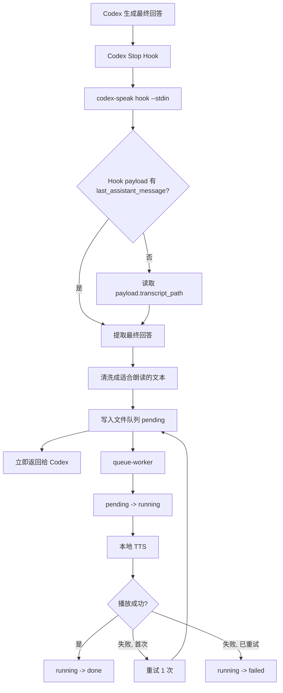
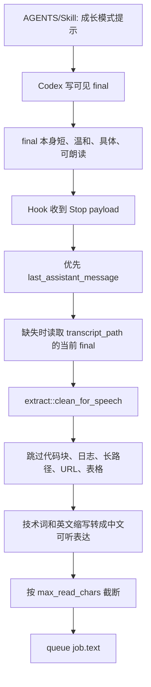

# Codex Speak 架构

## 一句话

Codex Speak 的成长模式把 Codex 最终回答变成适合孩子听的中文朗读，并用本地 TTS 播放。MVP 主路径是 Hook-first：不要求 Codex 每轮调用 MCP，也不再把隐藏协议块或单独的“朗读导览”塞进可见回答。

## 当前主路径



Hook 的主职责是“在正确的会话、正确的回合拿到最终回答并入队”，不是长时间等待 TTS。TTS 的串行播放由文件队列和 worker 负责。

## 职责边界

| 组件 | 主路径职责 | 不再承担 |
| --- | --- | --- |
| AGENTS/Skill hint | 让 Codex 的可见 final 默认适合孩子读和听 | 不强制调用 MCP；不输出隐藏协议或单独朗读章节 |
| Stop Hook | 接收 Codex turn-ended/Stop payload，识别当前 session 的最终回答 | 不猜全局 newest session；不直接播放；不长时间等锁 |
| `hook --stdin` | 从 stdin 解析 payload，按固定优先级提取文本，清洗并写入 queue job | 不消费 `spool/latest.json` 作为主路径 |
| 文件队列 | 用 `pending/running/done/failed` 串行化多个 session 的朗读 | 不依赖单槽全局 `latest.json` |
| queue worker | FIFO 取 job，调用本地 TTS，成功/失败后移动 job | 不阻塞 Codex session 完成 |
| TTS/播放器 | 本地生成和播放声音，使用播放锁避免音频重叠 | 不理解 Codex 任务上下文 |
| MCP side-channel | legacy/debug/future optional | 不作为成长模式 MVP 默认链路 |

## 朗读内容生成流程

成长模式 MVP 不再生成一份“屏幕外”的朗读稿。朗读内容默认来自可见 final answer，所以内容生成发生在 Codex 正常回答阶段：



算法顺序：

1. Codex 在最终回答里直接写适合孩子阅读和收听的内容。
2. Stop Hook 只处理 `Stop` / `SubagentStop` 事件。
3. 文本来源顺序固定为 `last_assistant_message`，然后是 `transcript_path` 中当前 session 的最后 final answer。
4. 没有有效 final、final 为空、或不是 Stop 事件时静默退出。
5. 清洗层删除或压缩不适合朗读的内容：代码块、diff、日志、表格、长链接、长路径、命令清单和 markdown 噪声。
6. 发音归一化把 `MCP`、`JSON`、`CLI`、文件名、脚本名和常见英文技术词转换成中文听感更自然的表达。
7. 生成 job id。优先使用 `session_id + turn_id`，字段缺失时使用 `transcript_path + final message hash` 兜底。
8. 同一 id 只入队一次；pending 最多 5 条，超限时丢弃最旧普通 job。

这个设计的核心取舍是：屏幕内容和朗读内容默认一致。为了孩子，final 本身就应该更清楚、更短、更自然；Hook 只做“清洗和播放”，不做第二个模型级总结。

## 并发与去重

多个 Codex chat session 同时结束时，Hook 会分别收到各自 payload。主路径禁止用 `newest_session_file()` 猜全局最新会话，避免 A 会话触发却读到 B 会话的 final。

队列目录：

```text
~/.codex/codex-speak/queue/pending/
~/.codex/codex-speak/queue/running/
~/.codex/codex-speak/queue/done/
~/.codex/codex-speak/queue/failed/
```

每个 job 是独立 JSON 文件。worker 用 `queue/worker.lock` 保证同一时间只有一个 worker 消费队列。job 从 `pending` 原子移动到 `running` 后才播放，成功进入 `done`，失败重试一次后进入 `failed`。

## 缺失内容策略

Hook-first 主路径的缺失策略是静默：

- 非 Stop 事件：静默退出。
- payload 没有 final，也没有可读 transcript：静默退出。
- 清洗后文本为空：静默退出。
- duplicate job：静默退出。

这和旧 MCP 架构不同。旧架构在没有 `latest.json` 时曾播放缺失导览提示，但成长模式 MVP 直接读 final，不再把“没有收到插件导览”当成用户需要听到的产品状态。

## Installer / Doctor

`codex-speak install` 默认做这些事：

- 安装 CLI、模型 manifest、Skill。
- 写入 `~/.codex/hooks.json` 的 Stop hook。
- 写入成长模式 AGENTS block。
- 创建 queue 目录。
- 移除旧 notify hook 配置。
- 移除旧全局 `mcp_servers.codex_speak` 配置，避免新 session 因 MCP 启动问题卡住。

`doctor/status` 的主检查改为：

- Stop hook 是否安装且脚本内容当前。
- 成长模式 AGENTS hint 是否存在。
- queue 目录是否可写。
- legacy MCP / plugin 是否仍残留。残留是 warning，不再是 required fail。

## Legacy MCP Side-Channel

旧主路径是：

```text
AGENTS/Skill -> codex_speak_prepare -> spool/latest.json -> Hook -> TTS
```

这条链路保留在代码中，用于调试、历史 fixture、未来需要屏幕内容和朗读内容分离的高级能力。它不再是成长模式 MVP 默认路径。旧架构细节、已修问题和踩坑记录见 [Legacy MCP Side-Channel](legacy-mcp-side-channel.md)。

## 当前验证状态

本地已覆盖：

- Hook payload 直接提取 `last_assistant_message`。
- 缺少直接消息时从 `transcript_path` 提取当前 final。
- 非 Stop / 空消息静默退出。
- `session_id + turn_id` 去重。
- 缺字段时 hash fallback 去重。
- queue FIFO、重复 id 跳过、pending 上限、dry-run worker。
- `cargo test` 全量通过。

发布前还需要真实 Codex Stop payload 烟测、两个 chat session 并发结束的手动验证，以及 Windows 真机安装/播放验证。
