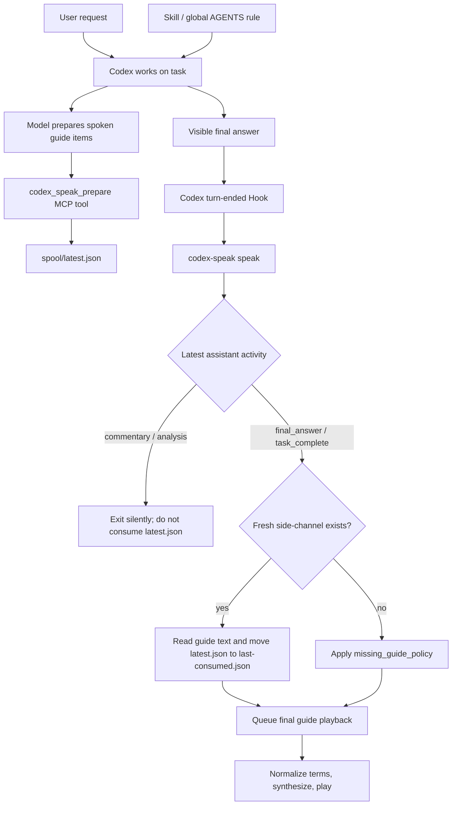
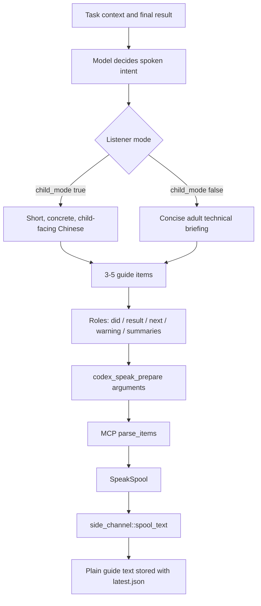
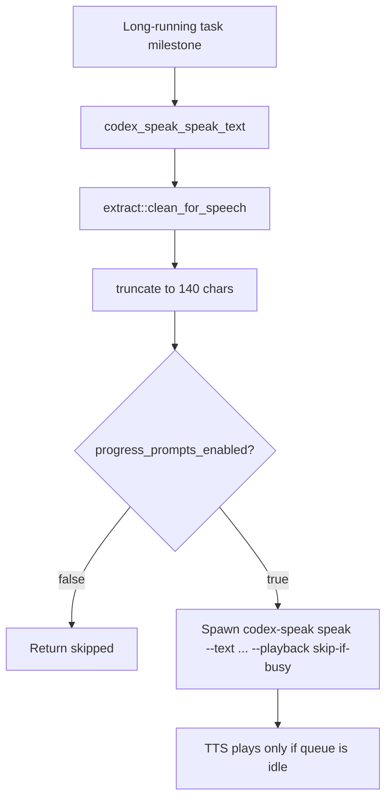

# Codex Speak 播报流程设计

## 设计目标

Codex Speak 的播报链路不朗读 Codex 的完整最终回答，也不让本地 Hook 猜测最终回答应该怎么总结。主路径是：

1. Codex Skill / 全局 AGENTS 规则告诉模型：最终回答前要准备朗读导览。
2. Codex 模型理解任务结果。
3. 模型在最终回答前调用 `codex_speak_prepare`。
4. MCP 把结构化朗读导览写入本地 side-channel。
5. Codex Hook 在回答结束后触发本地 CLI。
6. CLI 只在确认最近 assistant 活动是最终回答时消费 side-channel。
7. 本地 TTS 播放清洗后的中文导览。

这样可以把“语义理解”和“本地播放”分开：模型负责生成真正可听的内容，Rust 负责传输、判断、清洗和播放。

## 名词定义

**Skill**

Skill 是给 Codex 模型看的行为说明，不是本地播放程序。它的作用是让模型知道：

- 这次 final answer 前应该调用 `codex_speak_prepare`。
- 朗读导览要写成 3 到 5 条结构化 guide items。
- 儿童模式和成人模式分别应该怎么写。
- 不要把 HTML、隐藏协议或 `朗读导览` 文本塞进可见回答。

所以 Skill 位于“内容生成前”。它不负责保存文件、不判断 final phase、不播放声音。真正落盘的是 MCP，真正触发播放的是 Hook。

如果只安装 MCP 和 Hook，但没有 Skill 或全局 AGENTS 规则，模型可能不会主动调用 `codex_speak_prepare`。这就是之前“新 chat session 有 final answer 但没有导览”的根因。

**Spool**

Spool 是“待处理队列/暂存区”的意思。在 Codex Speak 里，它不是系统打印队列，而是一个本地小目录：

```text
~/.codex/codex-speak/spool/
```

`latest.json` 表示“下一次最终回答 Hook 要播放的朗读导览”。Hook 成功读取并播放前，会把它当作待消费文件；消费后移动成 `last-consumed.json`，避免重复播放。

这里用 `spool` 这个词，是因为它表达了“先把要读的内容放好，等 Hook 到时再取走”的异步关系。

## 总体流程



核心代码位置：

- MCP 工具 schema 和调用分发：`src/mcp.rs`
- side-channel 写入、读取、消费：`src/side_channel.rs`
- Hook 提取和 final phase 判断：`src/session.rs`
- CLI `speak` 入口和播放策略：`src/main.rs`
- TTS 前的发音归一化和播放：`src/tts.rs`、`src/pronunciation.rs`
- 历史协议和手动文本清洗：`src/extract.rs`

## 组件职责

| 组件 | 职责 | 不负责 |
| --- | --- | --- |
| Skill / 全局 AGENTS 规则 | 约束模型走主产品路径：final 前调用 MCP，按儿童/成人模式写 guide items | 不写文件、不播放、不保证旧 session 热加载 |
| Codex 模型 | 理解任务、选择儿童/成人风格、生成 3 到 5 条可听 guide items | 不直接播放、不把协议块塞进可见回答 |
| MCP server | 暴露 `codex_speak_prepare`，校验参数，写入 side-channel | 不重新理解任务、不二次总结最终回答 |
| side-channel | 保存下一次 Hook 要读的结构化导览 | 不判断当前 Codex phase |
| spool 目录 | 作为 side-channel 的本地暂存区，保存 `latest.json` 和 `last-consumed.json` | 不生成内容、不决定是否 final |
| Hook / CLI | 在回答结束后触发播放，判断最近 assistant activity，消费 side-channel | 不猜普通 final answer 的含义 |
| `extract` | 处理手动文本、fixture、历史协议兼容路径 | 不作为新回复的主路径 |
| TTS | 术语归一化、本地合成、播放队列、系统兜底 | 不决定导览内容结构 |

## 最终导览 Hook 算法

`src/main.rs` 的 `Command::Speak` 是 Hook 入口。没有显式 `--text` 和 `--fixture` 时，它被当作最终导览播放：

```text
load config
if final_guide_enabled is false:
    consume any pending latest.json
    exit

if no text and no fixture:
    playback_policy = Queue
else:
    playback_policy = Interrupt

text = session::resolve_text_for_speech(...)
if text is empty:
    exit

tts::speak_with_policy(config, text, playback_policy)
```

`src/session.rs` 的关键顺序是先判断 phase，再读取 side-channel：

```text
if this is Hook speech and no fixture:
    latest = latest_assistant_activity()
    if latest == NonFinal:
        return empty string

    if fresh latest.json exists:
        read it
        if consume_side_channel:
            move latest.json to last-consumed.json
        return guide text

    return missing_side_channel_notice_for_policy(config.missing_guide_policy)
```

这个顺序很重要。Codex Desktop 的 `commentary` 消息也可能触发 `turn-ended` notify。如果先读取 `latest.json` 再判断 phase，过程消息会提前消费导览，真正的 final hook 反而拿不到内容。

`latest_assistant_activity` 的判断规则：

| Session payload | 结果 |
| --- | --- |
| `task_complete` | `Final` |
| assistant `agent_message` with `phase = "final_answer"` | `Final` |
| assistant `message` with `phase = "final_answer"` | `Final` |
| assistant message without `phase` | `Final`，兼容旧格式 |
| assistant message with any other phase | `NonFinal` |
| latest user event | `User` |
| no recognizable event | `Unknown` |

当前实现只对 `NonFinal` 静默退出。读取 session 失败时使用 `unwrap_or(Final)`，这是偏保守的兼容策略：宁可在无法识别 session 时继续检查 side-channel，也不因为 session schema 小变化完全阻断已准备好的导览。

## 朗读内容生成流程

朗读内容生成是单独的一条语义链路，不应该混进 Hook 的本地规则。



### 1. 模型生成 guide items

模型在准备 final answer 前调用 `codex_speak_prepare`。输入不是一整段 Markdown，而是结构化 items：

```json
{
  "audience": "child",
  "style": "clear_bright",
  "lang": "zh-CN",
  "items": [
    { "role": "did", "text": "我刚刚检查了播报链路。" },
    { "role": "result", "text": "现在最终回答只会读插件准备好的导览。" },
    { "role": "next", "text": "下一步可以继续产品化安装器。" }
  ]
}
```

生成原则：

- 只讲用户需要听到的行动导览，不复述完整 final answer。
- 不读代码、命令、日志、长路径和原始 diff。
- 儿童模式更短、更具体，直接对“你”说话。
- 成人模式保留变更、验证、风险、下一步。
- `warning` 只在有未完成、失败、风险时使用。
- `visual-summary` 只概括可见图，不读 Mermaid 或 HTML 源码。

### 2. MCP 接收结构化内容

`src/mcp.rs` 给 `codex_speak_prepare` 定义 schema：

- `items` 必填。
- item 必须有 `role` 和 `text`。
- role 枚举包括 `did`、`why`、`code-summary`、`command-summary`、`visual-summary`、`result`、`next`、`warning`。

工具调用进入 `call_tool_by_name` 后：

1. 构造 `side_channel::SpeakSpool`。
2. 默认 `version = 1`。
3. 默认 `audience = "beginner"`。
4. 默认 `style = "clear-bright"`。
5. 默认 `lang = "zh-CN"`。
6. 写入 `source = "codex-speak-plugin"`。
7. 用 `parse_items` 提取 role/text。
8. 调用 `side_channel::write_latest`。
9. 更新 pet 状态为 ready。

MCP 不做复杂改写。它只把模型已经写好的结构化内容保存下来。

### 3. side-channel 合成文本

`src/side_channel.rs` 的 `spool_text` 是当前主路径的合成算法：

```text
items
  -> filter allowed role
  -> trim text
  -> drop empty text
  -> join with empty separator
  -> truncate to max_read_chars
```

允许 role 的过滤在 `is_allowed_role` 中实现。未知 role 会被丢弃，这给 schema 之外的调试字段留了安全边界。

当前 join 使用空字符串，不额外插入换行或标点。因此模型生成每条 item 时应该自带自然句号。否则两条 item 可能连在一起读得不自然。后续可以考虑把 join 改成 `join(" ")` 或在写入时补终止标点，但这属于输出质量优化，不影响架构边界。

`write_latest` 会把原始 `SpeakSpool` 写入：

```text
~/.codex/codex-speak/spool/latest.json
```

同时返回合成后的 `text`，供 MCP tool result 和 pet 状态预览使用。

### 4. Hook 读取并消费

`read_fresh_latest` 只接受 180 秒内修改过的 `latest.json`。过期文件不会被读取，也不会自动消费。

新鲜且可解析时：

1. 重新调用 `spool_text` 得到可读文本。
2. 如果文本为空，返回 `None`。
3. 如果 `consume = true`，调用 `consume_latest`。
4. `consume_latest` 优先 rename 到 `last-consumed.json`。
5. rename 失败时 fallback 到 copy + remove。

这个消费动作只应该发生在 final phase 之后。现在 `session::resolve_text_with_options` 已经保证非 final phase 不会走到消费步骤。

### 5. TTS 前归一化

side-channel 文本进入 `tts::speak_with_policy` 后，仍会经过 `pronunciation::normalize_for_tts`：

```text
load user pronunciation dictionary
protect user-defined replacements
replace common technical terms
replace spelled acronyms
replace file-like tokens
replace command flags
replace code identifiers
replace unknown uppercase acronyms
restore protected user terms
normalize spacing
```

这一步不是“生成导览”，而是“让已经生成好的导览更适合中文 TTS”。例如把 `MCP` 读成“插件通道”，把 `README.md` 读成“说明文件”，把 `codex_speak_prepare` 读成“准备朗读导览的插件工具”。

## 过程提示流程

过程提示不走 Hook，也不写 `latest.json`。它由模型在长任务中主动调用：



边界：

- 过程提示只说“正在做什么”。
- 最终导览才说“做了什么、结果如何、下一步怎么办”。
- 过程提示使用 `skip-if-busy`，不能抢最终导览。
- 最终 Hook 默认使用 `Queue`，保证完整播放。
- 手动 `speak --text` 默认使用 `Interrupt`，因为用户主动试听时需要立即反馈。

## 缺失导览策略

`missing_guide_policy` 控制 final phase 但没有 side-channel 时的行为：

| Policy | 行为 |
| --- | --- |
| `silent` | 返回空文本，Hook 静默退出。当前默认值。 |
| `brief_notice` | 播放一句短提示：这次回答完成了，但当前会话没有送来朗读导览。 |
| 其他值 | 播放诊断提示，提醒新开 Codex 会话或运行自检。 |

默认 `silent` 的原因是全局 Hook 会作用到所有 Codex session。不是每个 session 都一定加载了工具或遵守准备导览的指令，默认静默能避免无关会话被打扰。

## 历史兼容路径

`src/extract.rs` 仍保留 Markdown `朗读导览`、HTML microformat、隐藏注释等解析能力，但它们不是主产品路径。

使用场景：

- `codex-speak extract --text ...`
- `codex-speak speak --fixture ...`
- 历史 session 兼容。
- 手动 QA 和排障样例。

Hook 正常路径不应该依赖这些格式。没有 side-channel 时，本地规则不能假装理解完整 final answer。

## 当前架构风险

1. `latest.json` 是全局单槽。当前靠 180 秒新鲜度和最新 assistant phase 防误消费，但多 Codex 会话并发时仍可能串线。
2. `spool_text` 拼接 item 时不自动补空格或标点，对模型输出句号有依赖。
3. `session.rs` 同时负责 phase 检测、side-channel 选择、历史 fallback，后续可以拆模块。
4. 缺少 turn/session 级关联。理想状态是 `latest.json` 带 `thread_id`、`turn_id`、`created_at`，Hook 只消费当前 turn 的导览。
5. `doctor/status` 还应检查全局 AGENTS 规则、全局 MCP 与插件内 MCP 的期望状态，以及真实 Codex MCP framing。

## 推荐后续重构

优先级从高到低：

1. 给 `SpeakSpool` 增加 `thread_id`、`turn_id`、`created_at_ms`，让 Hook 精确匹配当前 turn。
2. 把 `session.rs` 拆成 `activity_detector`、`guide_resolver`、`legacy_session_extract`。
3. 把 `spool_text` 的句子拼接规则产品化：自动补句号或用安全分隔符连接。
4. 安装器写入和维护全局 Codex Speak AGENTS block。
5. `doctor/status` 增加真实 MCP 注入、双 framing、AGENTS block、重复 MCP 注册状态检查。
6. 控制面板显示最近一次朗读来源：MCP side-channel、过程提示、缺失提示、手动试听。
