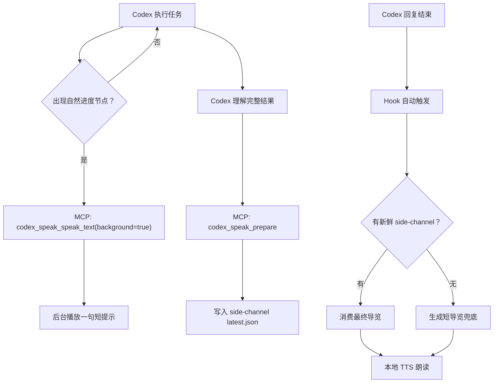

# Codex Speak 朗读时机策略

## 一句话

Codex Speak 默认不做逐字流式朗读，而是采用“过程中少量进度提示，结束后完整导览”的混合策略。

## 为什么不逐字流式朗读

Codex 的聊天输出是给人看的，生成过程中经常会先出现代码、命令、长路径、日志、半句话或临时判断。如果把这些内容按 token 或按行立刻送进 TTS，会带来几个问题：

- 孩子听到的是碎片，不容易知道重点。
- 代码、路径和英文技术词可能在清洗前就被读出来。
- Codex 后续可能修正前面的说法，已经读出的内容会误导用户。
- TTS 队列容易积压，停止、打断和恢复都会变复杂。
- Hook 无法在回复流式输出中触发，它天然适合回复结束后的自动播放。

所以 Codex Speak 的核心价值不是“更早读出文字”，而是“读出 Codex 理解后的可行动导览”。

## 推荐策略

### 1. 过程提示通道

长任务中可以通过 MCP 工具播放短句：

```text
codex_speak_speak_text
background = true
```

这个通道只用于自然进度节点，例如：

- 我开始运行测试了。
- 构建已经通过，我正在检查打包结果。
- 我发现一个问题，正在修改。
- 下载模型可能要等一会儿。

过程提示必须短、少、非权威，不读代码、命令、日志、路径或完整回答。

### 2. 最终导览通道

任务结束前，Codex 通过 MCP 工具写入结构化导览：

```text
codex_speak_prepare
```

它会写入：

```text
~/.codex/codex-speak/spool/latest.json
```

Codex 回复结束后，Hook 触发 Rust CLI，优先消费这份 side-channel，并交给本地 TTS 朗读。最终导览是权威内容，应该说明：

- Codex 刚才做了什么。
- 代码、命令或检查解决了什么问题。
- 结果是否成功。
- 下一步用户可以怎么继续。

### 3. 兜底通道

如果 MCP 不可用，Skill 仍然输出自然、简短、适合朗读的最终回答。Hook 会把最终可见回复压缩成 3 到 4 句导览式兜底，而不是朗读整段回复。

历史 HTML/Markdown 协议只用于旧会话和排障兼容，不作为新回答的默认输出方式。

## 架构图



## 产品默认值

| 场景 | 默认行为 |
| --- | --- |
| 普通短回答 | 不额外过程提示，必要时结束后朗读短导览 |
| 代码修改、调研、排障 | 结束后朗读完整导览 |
| 测试、构建、下载、打包等长任务 | 过程中最多几句进度提示，结束后朗读完整导览 |
| 语音预览 | 直接使用 `codex_speak_speak_text` |
| MCP 不可用 | Hook 从最终可见回复生成短导览 |

## Tauri 控制面板建议

控制面板应把朗读时机做成用户能理解的设置：

- 总朗读开关：默认开启，关闭后所有播放都停止。
- 自动朗读最终导览：默认开启。
- 任务中进度提示：默认开启，但只播少量短句。
- 逐字朗读聊天输出：默认关闭，第一版不作为推荐功能。
- 停止朗读：任何时候都应该可用。

对应配置项：

```toml
enabled = true
final_guide_enabled = true
progress_prompts_enabled = true
```

未来如果 Codex 提供稳定的流式消息事件接口，可以把“逐字朗读聊天输出”作为实验功能，但必须先经过清洗、分句、去重、打断和队列控制，不能直接读原始 token。
