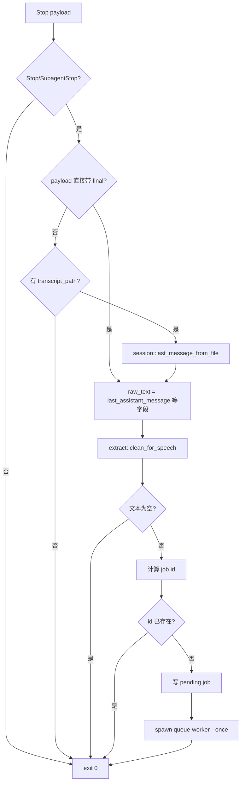

# Codex 朗读助手技术文档

## 技术结论

成长模式 MVP 采用 Hook-first 架构：

```text
AGENTS / Skill hint
  -> 引导 Codex 把可见 final 写成孩子能读、能听的回答
Codex Stop Hook
  -> 回复结束后把当前 session payload 交给本地 CLI
codex-speak hook --stdin
  -> session-aware 提取 final，清洗，写入文件队列
queue-worker
  -> FIFO 串行播放，不阻塞 Codex session
本地 TTS
  -> Sherpa-ONNX / Piper / system provider
控制面板
  -> 配置开关、语速、provider、停止、试听、模型安装
```

MCP side-channel 仍保留在代码中，但定位改为 legacy/debug/future optional。默认安装不再写入全局 `mcp_servers.codex_speak`，也不要求 Codex 每轮调用 `codex_speak_prepare`。

## 设计原则

- Codex 负责把最终回答写得清楚、温和、适合朗读。
- Hook 负责可靠触发、定位当前 session、快速入队。
- Worker 负责串行播放和失败处理。
- TTS 只处理声音，不理解任务上下文。
- 主路径不依赖 agent 记得调用工具，也不让 MCP 启动失败卡住新 session。
- 不在可见回答中加入隐藏协议块、HTML 朗读块或单独的“朗读导览”章节。

## 组件分工

| 组件 | MVP 是否主路径 | 职责 |
| --- | --- | --- |
| AGENTS hint | 是 | 给所有新 session 一个很短的成长模式写作约束 |
| Skill | 是，但轻量 | 被触发时补充更详细的成长模式写作规则 |
| Stop Hook | 是 | 监听 Codex Stop 生命周期事件 |
| `hook --stdin` | 是 | 从 hook payload 提取当前 final，清洗并入队 |
| 文件队列 | 是 | 跨 session 串行化朗读任务 |
| `queue-worker` | 是 | 消费队列并调用 TTS |
| 本地 TTS | 是 | 生成和播放声音 |
| MCP | 否 | legacy/debug，保留 side-channel、状态、试听、配置等能力 |
| `spool/latest.json` | 否 | legacy side-channel 单槽，不再是默认最终朗读来源 |

## Stop Hook 输入契约

Hook 入口：

```bash
codex-speak hook --stdin
```

从 stdin 读取 Codex hook payload。主路径只接受：

```text
hook_event_name = "Stop" 或 "SubagentStop"
```

文本来源固定顺序：

1. `last_assistant_message`
2. `last_agent_message`
3. `assistant_message`
4. `message`
5. `transcript_path` 指向的当前 session 文件
6. 无有效 final 时静默退出

禁止主路径使用全局 newest session 作为默认来源。`newest_session_file()` 只能保留给手动调试、旧命令或测试，不用于 Stop hook 的当前会话判断。

## 朗读内容处理算法



清洗规则：

- 删除 fenced code、diff、表格、日志噪声和 Markdown 装饰。
- 压缩长路径、长 URL、命令输出和 release metadata。
- 保留最有用的自然语言结论。
- 用发音归一化把常见技术词变成中文可听表达，例如 `MCP` -> “插件通道”、`JSON` -> “数据格式”、`CLI` -> “命令行工具”。
- 按 `max_read_chars` 限制长度，尽量在句子边界截断。

job id：

```text
stable_hash(session_id 或 transcript_path 或 "unknown-session")
:
stable_hash(turn_id 或 raw final hash)
```

这样有 `session_id + turn_id` 时精确去重；缺字段时仍能对同一 transcript 和同一 final 做稳定去重。

## 文件队列

目录：

```text
~/.codex/codex-speak/queue/
  pending/
  running/
  done/
  failed/
  worker.lock
```

job 格式：

```json
{
  "id": "session-or-transcript:turn-or-hash",
  "session_id": "...",
  "turn_id": "...",
  "transcript_path": "...",
  "created_at_ms": 0,
  "source": "codex-stop-hook",
  "priority": "normal",
  "text": "...",
  "attempts": 0
}
```

队列策略：

- 同一 `id` 只保留一条。
- pending 最多 5 条。
- 超过上限时丢弃最旧普通 job。
- worker 按文件名时间戳 FIFO。
- worker 启动后先抢 `worker.lock`，已有 worker 时直接退出。
- 播放前 `pending -> running`。
- 成功 `running -> done`。
- 失败首次重试一次；第二次失败 `running -> failed`。
- `queue-worker --once --no-play` 用于 dry-run，不生成声音。

现有 `PlaybackPolicy::Queue` 仍用于 TTS 进程内播放互斥，防止音频重叠；它不再承担 Hook 等待队列职责，因为 Hook 不能为了等锁阻塞几分钟。

## Installer / Uninstaller

`codex-speak install` 默认：

```text
安装 CLI / release manifest / Skill
写入 Stop hook wrapper
更新 ~/.codex/hooks.json
写入 ~/.codex/AGENTS.md 成长模式 block
创建 queue 目录
移除旧 notify hook 配置
移除旧全局 mcp_servers.codex_speak
安装或保留控制面板和 TTS 资产
```

不再默认：

- 写入全局 MCP server。
- 自动启用 `codex-speak@personal` 作为主路径。
- 要求新 Codex thread 加载 MCP 工具后才能朗读。

`codex-speak uninstall`：

```text
停止朗读进程
移除 Codex Speak Stop hook
移除 AGENTS 成长模式 block
移除旧 notify hook
移除旧全局 mcp_servers.codex_speak
清理 pending/running 队列
保留 logs/done 和模型，除非后续增加显式清理选项
```

## Doctor / Status

主检查：

- CLI 是否存在。
- Stop hook 是否配置在 `~/.codex/hooks.json`。
- Stop hook wrapper 是否与当前 CLI 内置版本一致。
- AGENTS 成长模式 hint 是否存在。
- queue 目录是否可写。
- TTS 模型和播放器是否可用。
- legacy global MCP / plugin 是否残留。残留只给 warning。

`doctor --json` 应该能让排障者一眼看出：当前主链路是 Hook-first，MCP 不是 required dependency。

## MCP Legacy

旧路径：

```text
AGENTS/Skill -> codex_speak_prepare -> ~/.codex/codex-speak/spool/latest.json -> Hook -> TTS
```

它解决过“屏幕内容和朗读内容分离”的问题，但带来这些 MVP 成本：

- Codex 需要记得每轮 final 前调用工具。
- MCP server 启动或握手失败可能卡住 session。
- 全局 `latest.json` 是单槽，天然不适合多 session 并发。
- commentary / final phase 判断复杂，容易提前消费 stale latest。
- 半卸载后残留 MCP 配置会继续影响新 session。

因此成长模式 MVP 改为直接朗读 final。MCP 仅保留给调试、历史兼容、未来 ask-user/高级摘要/屏幕和朗读分离等场景。详细记录见 [Legacy MCP Side-Channel](legacy-mcp-side-channel.md)。

## TTS Provider

推荐顺序：

```text
默认：Sherpa-ONNX + MeloTTS zh_en
增强：Sherpa-ONNX + Kokoro 中文/多语言模型
实验：Sherpa-ONNX + ZipVoice
低配兜底：Piper zh_CN
最后兜底：系统语音
```

| Provider | 运行方式 | 必需文件 | 失败策略 |
| --- | --- | --- | --- |
| `sherpa_melo` | `sherpa-onnx-offline-tts` VITS/Melo 参数 | `model.onnx`、`tokens.txt`、`lexicon.txt` | 可按配置兜底到系统语音 |
| `sherpa_kokoro` | Sherpa Kokoro 参数 | `model.onnx`、`voices.bin`、`tokens.txt`、词典或 `espeak-ng-data` | 直接提示缺模型 |
| `sherpa_zipvoice` | Sherpa ZipVoice 参数 | `encoder.onnx`、`decoder.onnx`、`vocoder.onnx`、`tokens.txt`、参考音频和文本 | 直接提示缺模型 |
| `piper` | Sherpa 运行 Piper/VITS 模型 | `model.onnx`、`tokens.txt`、`lexicon.txt` | 直接提示缺模型 |
| `system` | macOS `say` 或 Windows SpeechSynthesizer | 系统能力 | 无模型验证和最后兜底 |

模型安装命令：

```bash
codex-speak models install --provider sherpa_melo
codex-speak models install --provider sherpa_kokoro
codex-speak models install --provider piper
codex-speak models install --all
```

## 控制面板

Tauri 控制面板不直接做 TTS 推理，调用同一个 CLI：

```text
Tauri UI -> Tauri backend -> codex-speak CLI -> config / stop / speak / doctor
```

它提供：

- 总朗读开关。
- 过程提示和最终朗读开关。
- 成长模式提示配置。
- 语速、最大朗读字数、provider、声音档位。
- 模型安装、试听、停止、自检。
- macOS desktop pet 状态展示。

控制面板修改的是 `~/.codex/codex-speak/config.toml`。Hook 每次运行读取当前配置，所以朗读开关、语速、provider 等运行时配置可以立即影响下一次 Stop hook。AGENTS/Skill 这类 Codex prompt 侧提示通常需要新 session 或重启 Codex 才稳定生效。

## 配置示例

```toml
enabled = true
final_guide_enabled = true
progress_prompts_enabled = true
language = "zh"
child_mode = true
missing_guide_policy = "silent"
max_read_chars = 800

provider = "sherpa_melo"
speed = 0.82
voice_profile = "clear_bright"
```

`child_mode` 当前仍保留在配置和控制面板中，但产品语义改为成长模式。后续可以迁移字段名，例如新增 `growth_mode = true` 并兼容读取旧字段。

## 开发验证

```bash
cargo test hook -- --nocapture
cargo test queue -- --nocapture
cargo test doctor -- --nocapture
cargo test -- --nocapture
cargo check
cargo build --release
```

还需要补充或保留的集成验证：

- 构造两个 session 的 Stop payload，确认 A/B 不串。
- Hook 入队后快速退出，不等待 TTS。
- `codex-speak install` 后不再写入全局 MCP。
- `doctor --json` 对 legacy MCP 残留给 warning。
- 真机新 Codex thread 只靠 Stop hook 播放 final。
- Windows 真机安装、播放、卸载验证。

## 主要风险

- Codex Stop payload 字段在不同 Codex 版本中可能变化，需要保持 payload fixture 更新。
- final 直接作为朗读来源要求 Codex 回答本身更短、更自然；AGENTS hint 要足够稳定。
- 清洗规则不能替代模型理解，过长或代码密集 final 仍可能需要用户手动重读或未来引入 optional side-channel。
- 文件队列要定期处理 `done/failed` 目录体积，避免长期堆积。
- Windows 音频播放和路径权限仍需真机验证。

## 参考资料

- [Codex Speak 架构](architecture.md)
- [Legacy MCP Side-Channel](legacy-mcp-side-channel.md)
- [问题记录](issue-log.md)
- [朗读风格指南](speech-style-guide.md)
- [Tauri 控制面板](tauri-control-app.md)
