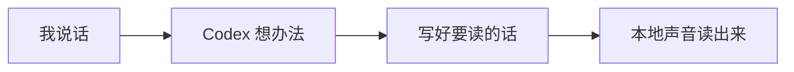

# 儿童可视化学习

## 目标

儿童模式不只朗读，还可以在聊天窗口里显示一个小图，帮助孩子理解抽象内容。

可视化不是装饰，也不是每次都要有。它只在这些情况出现：

- 架构：谁把消息交给谁。
- 流程：先做什么，再做什么。
- 状态：待命、处理中、成功、失败。
- 因果：为什么一个小改动会让结果变化。
- 对比：改动前和改动后有什么不同。

Codex 要自己判断是否需要画图，不等用户提出“画图”。判断重点是：图能不能比一句话更省理解成本。

自动判断：

- 如果是按钮、开关、简单结果，通常不用图。
- 如果有多个东西互相传递消息，可以画流程图。
- 如果有“之前/现在”的差别，可以画前后对比。
- 如果有“待命/进行中/完成/出错”，可以画状态图。
- 如果孩子可能不知道为什么要测试，可以画“改动 -> 检查 -> 通过”的小路线。
- 如果画出来更复杂，就不画。

朗读负责陪孩子看图：

```text
我还画了一张小图。
你可以看箭头。
它告诉我们，消息先到这里，再变成声音。
```

朗读不负责读 Mermaid、HTML、图片文件名或图表源码。

## 三种视觉能力

| 能力 | 默认程度 | 用途 | 说明 |
| --- | --- | --- | --- |
| Mermaid | 默认推荐 | 架构、流程、状态变化 | 本地、轻量、适合 Codex 聊天窗口 |
| 简单 HTML | 默认可用 | 对比卡、步骤卡、颜色块 | 用很小的结构，不做复杂页面 |
| 生成图片 | 可选增强 | 角色、比喻、场景记忆点 | 可以用 image model，但不能作为本地免费核心依赖 |

## Mermaid 规则

适合：

- “Codex 到声音”的流程。
- “开关打开/关闭”的状态。
- “失败 -> 找线索 -> 修复 -> 测试”的排障路线。

限制：

- 3 到 6 个节点。
- 节点文字必须是孩子能听懂的短词。
- 不放路径、命令、类名、函数名。
- 不用复杂子图，除非用户正在学架构。

示例：



配套朗读：

```text
我画了一张小图。你可以顺着箭头看：先是你说话，然后 Codex 想办法，最后本地声音读出来。
```

## 简单 HTML 规则

适合：

- 前后对比。
- 小卡片解释一个难词。
- 用颜色表现“成功/需要检查/失败”。

限制：

- 不嵌套复杂卡片。
- 不写长段说明。
- 不依赖外部脚本。
- HTML 只放在可见回答中，不进入朗读 side-channel。

## 生成图片规则

生成图片适合孩子需要具象化的时候，例如：

- 把“消息流动”画成小纸条走过几个站点。
- 把“测试”画成小侦探找线索。
- 把“状态机”画成小火车停靠不同站台。

原则：

- 生成图片是可选增强，不是核心依赖。
- 本地免费产品不能默认依赖在线图片模型。
- 如果使用 image model，优先生成一张简洁、明亮、无文字或少文字的解释图。
- 不让图片替代真实操作结果。

## 和朗读协议的配合

`codex_speak_prepare` 支持 `visual-summary` 角色。它只放一句给 TTS 读的图意说明，不放图表源码。

示例：

```json
{
  "role": "visual-summary",
  "text": "我还画了一张小图，帮你看到消息是怎么从 Codex 走到声音里的。"
}
```

## 什么时候不要画图

- 孩子只是要一个很短的答案。
- 当前任务更需要马上操作。
- 画图会比文字更复杂。
- 内容是隐私、错误日志或长路径。
- 已经有足够清楚的实物界面可看。
- 只是为了展示能力，而不是为了帮助理解。

## 后续产品化

第一阶段：Skill 规则让 Codex 在需要时直接输出 Mermaid/HTML，并通过 `visual-summary` 让朗读自然提到这张图。

第二阶段：控制面板可增加“视觉辅助”开关：

```text
visual_aids_enabled = true
visual_aids_level = "auto" | "always_ask" | "off"
```

第三阶段：本地样例库增加视觉样例，必要时做本地检索；image model 作为可选插件能力接入。
